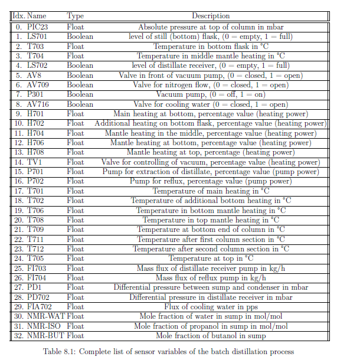

# Benchmark-Suite-for-Verifying-Neural-Anomaly-Detectors-on-Time-Series-Data
Neural networks and specifications for batch distillation processes

Abbreviations:

onlyPressure: Networks trained only on the absolute pressure variable  
4meas: Networks trained on the first four variables of the table below  
ALLmeas: Networks trained on all variables of the table below  

